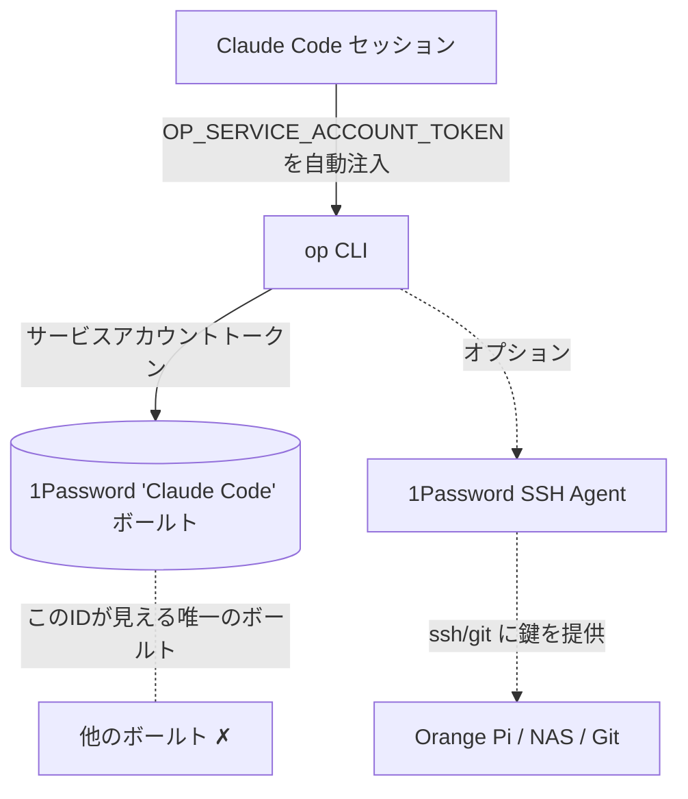

# claude-code-1password — 日本語ガイド

AI コーディングエージェント(Claude Code)に 1Password 経由で秘密情報を**安全かつ静かに**アクセスさせます — 承認プロンプトなし、デスクトップロック解除不要、24/7。

> ⚠️ このリポジトリに秘密情報は含まれません。`<YOUR_SERVICE_ACCOUNT_TOKEN>` を自分のものに置き換えてください。

---

## 動作の仕組み(アーキテクチャ図)



**凡例:**
- `op CLI` は **Claude Code** ボールトを読み書き — デスクトップアプリ不要
- サービスアカウントは他のボールトを**絶対に見られない**
- SSH Agent(オプション)は鍵を直接 `ssh`/`git` に提供

---

## クイックスタート

### 1. サービスアカウントを作成
`https://my.1password.com` → **サービスアカウント** → **サービスアカウント作成** に移動。
エージェントに使わせたい**その1つの**ボールトのみにアクセスを許可します(例 `Claude Code`)。
`ops_...` トークンをコピーします(一度だけ表示)。

### 2. トークンを2箇所に配置

**A. シェル環境変数**(設定ファイルを書き換えるツールに強い):
```bash
echo 'export OP_SERVICE_ACCOUNT_TOKEN="<YOUR_SERVICE_ACCOUNT_TOKEN>"' >> ~/.zshenv
echo 'export OP_VAULT="Claude Code"' >> ~/.zshenv
```

**B. Claude Code のグローバル設定** — `~/.claude/settings.json` を編集:
```json
{
  "env": {
    "OP_SERVICE_ACCOUNT_TOKEN": "<YOUR_SERVICE_ACCOUNT_TOKEN>"
  }
}
```

### 3. `op` をプロンプトなしで許可
`~/.claude/settings.json` の `permissions.allow` に追加(またはプロジェクトレベルの `.claude/settings.local.json`。こちらはツールに上書きされにくい):
```json
"permissions": {
  "allow": [
    "Bash(op item get --vault=\"Claude Code\" *)",
    "Bash(op item get * --vault=\"Claude Code\" *)",
    "Bash(op item list --vault=\"Claude Code\" *)",
    "Bash(op item list * --vault=\"Claude Code\" *)",
    "Bash(op vault list)",
    "Bash(op item create --vault=\"Claude Code\" *)",
    "Bash(op item edit --vault=\"Claude Code\" *)",
    "Bash(op account list)",
    "Bash(op whoami)"
  ]
}
```

### 4. 確認
```bash
op whoami                  # → User Type: SERVICE_ACCOUNT
op item list --vault="Claude Code"
```

---

## 遭遇した落とし穴(必読)

1. **MCP サーバーは値を読み取れない。** `1password-mcp` は Environments への書き込みのみで、秘密情報を返しません。`op` CLI を使いましょう。
2. **`op` は代入構文を使う。** `op item create ... username="u" password="p"` — `--username`/`--password` フラグではありません。
3. **デスクトップの12時間制限は変更不可。** 新しいターミナル + 10分のアイドル + 12時間のハードリミットで Touch ID 再認証が必要。回避できるのはサービスアカウントのみ。
4. **サービスアカウントは静かに削除されることがある**(403 Service Account Deleted)。ボールト内に復旧用コピーを残しましょう。
5. **他のツールが settings.json を消すことがある。** モデルスイッチャー(例 CC Switch)が設定を書き換え、トークンと権限が消えました。`~/.zshenv` にトークンを置くと安全です。
6. **許可リストの glob は脆い。** 引数の順序・引用符が完全一致する必要があります。必ず `op item get --vault="Claude Code" "<タイトル>"`(vault を先頭に)。
7. **SSH の `IdentitiesOnly=yes` は 1Password エージェントを壊す。** 外してエージェントに任せましょう。
8. **SSH エージェントはカスタムボールトを見ない。** `~/.config/1Password/ssh/agent.toml` に `[[ssh-keys]]` エントリで指定します(`[[vaults]]` ではない)。
9. **サービスアカウントをたくさん作ると繰り返し削除される。** アクティブなものは1つだけに。作成後すぐ `op whoami` で確認。

---

## 長所と短所

**長所**
- ✅ 設定後はプロンプトなし
- ✅ アプリがロック・クローズ中でも動作
- ✅ 単一ボールトでリスク小
- ✅ SSH エージェントでローカル鍵ファイル不要

**短所**
- ⚠️ 1ボールト限定(他にも必要なら制約)
- ⚠️ トークン漏洩 = そのボールトへの全アクセス — すぐにローテーション
- ⚠️ 設定が他ツールに上書きされる可能性(`~/.zshenv` を使う)
- ⚠️ デスクトップ方式には12時間の Touch ID 制限

---

## エージェントプロンプト(コピー＆ペースト)

これをエージェントのカスタム指示 / CLAUDE.md / システムプロンプトに貼り付けます:

```
あなたは 1Password への安全なアクセス権を持っています。`op` CLI を使用してください — MCP サーバーは絶対に使わない(値を読めません)。

ルール:
1. ユーザーが新しい key/パスワード/token を渡したら、必ず自動で 1Password に保存する:
   - サイト/デバイスログイン -> op item create --vault="Claude Code" --category=login --title="<名前>" username="<ユーザー名>" password="<パスワード>"
   - API key/token          -> op item create --vault="Claude Code" --category="API Credential" --title="<名前>" credential="<値>"
2. 秘密情報が必要なときは自分で読む(ユーザーに聞かない):
   - op item get --vault="Claude Code" "<タイトル>" --fields password --reveal
   - op item list --vault="Claude Code"
3. --vault="Claude Code" はタイトルの前に置く。
4. 代入構文を使う(username="x", password="y", credential="z")。
5. "Claude Code" ボールトのみ操作する。
6. 実際の秘密情報の値をメモリファイルやノートに書かない — 項目名だけ。
7. op が "No accounts configured" や "Service Account Deleted" とエラーしたら、ユーザーに OP_SERVICE_ACCOUNT_TOKEN を確認してもらい、my.1password.com でサービスアカウントを再作成するよう伝える。
```

---

## セキュリティ

- 生のトークンを含む `settings.json` をコミットしない。
- チャット・スクリーンショット・信頼できないリポジトリに晒したトークンは必ずローテーション。
- `1password-credentials.json`(アカウント復旧ファイル)はアカウント全体をリセット可能 — ローカルのみに。

---

## 公式リファレンス

**1password.com(製品 / コンソール)**
- 1Password ホーム: <https://1password.com>
- 1Password ウェブコンソール(サービスアカウント作成・ポリシー管理): <https://my.1password.com>
- 1Password サービスアカウントドキュメント: <https://developer.1password.com/docs/service-accounts/>

**1password.dev(開発者ドキュメント)**
- CLI クイックスタート(インストール、`op`、デスクトップ連携): <https://www.1password.dev/cli/get-started/>
- **デスクトップ連携セキュリティ — 10分のアイドル / 12時間のハードリミット(公式)**: <https://www.1password.dev/cli/app-integration-security>
  > "Authorization expires after 10 minutes of inactivity in the terminal session. There's a **hard limit of 12 hours**, after which you must reauthorize."
  > (承認はターミナルでの10分の非アクティブ後に失効します。**12時間のハードリミット**があり、その後は再認証が必要です。)
  > デスクトップ(Touch ID)方式が頻繁に承認を求める理由はここにあります:12時間制限は**変更不可**です。回避できるのはサービスアカウントのみ。
- SSH & Git(1Password SSH Agent 概要): <https://www.1password.dev/ssh>
- SSH Agent セットアップ: <https://www.1password.dev/ssh/agent/>
- SSH Agent 設定ファイル(`agent.toml`、カスタムボールト): <https://www.1password.dev/ssh/agent/config/>
- MCP サーバー(1Password Environments — 書き込みのみ、値は読めない): <https://www.1password.dev/environments/mcp-server>
- Agentic Autofill(Browserbase 連携、別機能): <https://www.1password.dev/agentic-autofill>

---

## ライセンス
MIT — ドキュメント/テンプレートのみ。秘密情報なし。
