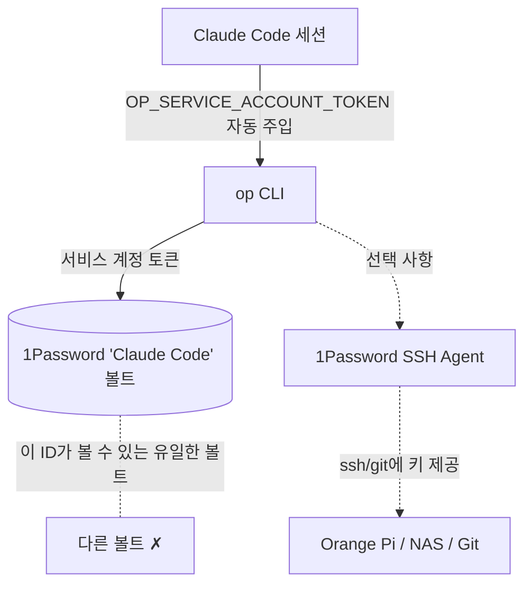

# claude-code-1password — 한국어 가이드

AI 코딩 에이전트(Claude Code)가 1Password를 통해 비밀 정보를 **안전하고 조용히** 접근하도록 합니다 — 승인 프롬프트 없음, 데스크톱 잠금 해제 불필요, 24/7.

> ⚠️ 이 리포지토리에는 비밀이 없습니다. `<YOUR_SERVICE_ACCOUNT_TOKEN>`을 자신의 것으로 바꾸세요.

---

## 동작 원리(아키텍처 다이어그램)



**범례:**
- `op CLI`는 **Claude Code** 볼트를 읽고 씁니다 — 데스크톱 앱 불필요
- 서비스 계정은 다른 볼트를 **절대 볼 수 없습니다**
- SSH Agent(선택)는 키를 `ssh`/`git`에 직접 제공합니다

---

## 빠른 시작

### 1. 서비스 계정 생성
`https://my.1password.com` → **서비스 계정** → **서비스 계정 만들기**로 이동.
에이전트가 사용할 **하나의** 볼트에만 액세스를 부여하세요(예: `Claude Code`).
`ops_...` 토큰을 복사하세요(한 번만 표시됨).

### 2. 토큰을 두 곳에 배치

**A. 셸 환경 변수**(설정 파일을 덮어쓰는 도구에 강함):
```bash
echo 'export OP_SERVICE_ACCOUNT_TOKEN="<YOUR_SERVICE_ACCOUNT_TOKEN>"' >> ~/.zshenv
echo 'export OP_VAULT="Claude Code"' >> ~/.zshenv
```

**B. Claude Code 전역 설정** — `~/.claude/settings.json` 편집:
```json
{
  "env": {
    "OP_SERVICE_ACCOUNT_TOKEN": "<YOUR_SERVICE_ACCOUNT_TOKEN>"
  }
}
```

### 3. `op`를 프롬프트 없이 허용
`~/.claude/settings.json`의 `permissions.allow`에 추가(또는 프로젝트 레벨 `.claude/settings.local.json`. 이쪽은 도구에 덮어써지지 않음):
```json
"permissions": {
  "allow": [
    "Bash(op item get --vault=\"Claude Code\" *)",
    "Bash(op item get * --vault=\"Claude Code\" *)",
    "Bash(op item list --vault=\"Claude Code\" *)",
    "Bash(op item list * --vault=\"Claude Code\" *)",
    "Bash(op vault list)",
    "Bash(op item create --vault=\"Claude Code\" *)",
    "Bash(op item edit --vault=\"Claude Code\" *)",
    "Bash(op account list)",
    "Bash(op whoami)"
  ]
}
```

### 4. 확인
```bash
op whoami                  # → User Type: SERVICE_ACCOUNT
op item list --vault="Claude Code"
```

---

## 겪은 문제점(꼭 읽으세요)

1. **MCP 서버는 값을 읽을 수 없습니다.** `1password-mcp`는 Environments에 쓰기만 하고 비밀 정보를 반환하지 않습니다. `op` CLI를 사용하세요.
2. **`op`는 할당 구문을 사용합니다.** `op item create ... username="u" password="p"` — `--username`/`--password` 플래그가 아닙니다.
3. **데스크톱 12시간 제한은 변경 불가.** 새 터미널 + 10분 유휴 + 12시간 하드 리밋 모두 Touch ID 재인증이 필요. 우회할 수 있는 건 서비스 계정뿐입니다.
4. **서비스 계정은 조용히 삭제될 수 있습니다**(403 Service Account Deleted). 볼트 안에 복구용 토큰 사본을 보관하세요.
5. **다른 도구가 settings.json을 지울 수 있습니다.** 모델 스위처(예: CC Switch)가 설정을 덮어써 토큰과 권한이 사라졌습니다. `~/.zshenv`에 토큰을 두면 안전합니다.
6. **허용 목록 glob은 취약합니다.** 인자 순서·따옴표가 정확히 일치해야 합니다. 항상 `op item get --vault="Claude Code" "<제목>"`(vault를 앞에).
7. **SSH `IdentitiesOnly=yes`는 1Password 에이전트를 망가뜨립니다.** 제거하고 에이전트에 맡기세요.
8. **SSH 에이전트는 커스텀 볼트를 보지 못합니다.** `~/.config/1Password/ssh/agent.toml`에 `[[ssh-keys]]` 항목으로 지정하세요(`[[vaults]]`가 아님).
9. **서비스 계정을 많이 만들면 반복 삭제됩니다.** 활성 계정은 하나만 유지. 만든 직후 `op whoami`로 확인.

---

## 장단점

**장점**
- ✅ 설정 후 프롬프트 없음
- ✅ 앱이 잠겨 있어도 동작
- ✅ 단일 볼트로 리스크 최소
- ✅ SSH 에이전트로 로컬 키 파일 불필요

**단점**
- ⚠️ 하나의 볼트로 제한(더 필요하면 제약)
- ⚠️ 토큰 유출 = 그 볼트 전체 읽기/쓰기 — 즉시 교체
- ⚠️ 설정이 다른 도구로 덮어써질 수 있음(`~/.zshenv` 사용)
- ⚠️ 데스크톱 방식은 12시간 Touch ID 제한

---

## 에이전트 프롬프트(복사하여 붙여넣기)

에이전트의 사용자 지정 지시 / CLAUDE.md / 시스템 프롬프트에 붙여넣으세요:

```
당신은 1Password에 대한 안전한 액세스 권한을 가집니다. `op` CLI를 사용하세요 — MCP 서버는 절대 사용하지 마세요(값을 읽을 수 없음).

규칙:
1. 사용자가 새 key/비밀번호/token을 주면, 항상 자동으로 1Password에 저장하세요:
   - 웹사이트/기기 로그인 -> op item create --vault="Claude Code" --category=login --title="<이름>" username="<사용자명>" password="<비밀번호>"
   - API key/token      -> op item create --vault="Claude Code" --category="API Credential" --title="<이름>" credential="<값>"
2. 비밀 정보가 필요하면 스스로 읽으세요(사용자에게 묻지 마세요):
   - op item get --vault="Claude Code" "<제목>" --fields password --reveal
   - op item list --vault="Claude Code"
3. --vault="Claude Code"를 제목 앞에 두세요.
4. 할당 구문을 사용하세요(username="x", password="y", credential="z").
5. "Claude Code" 볼트만 조작하세요.
6. 실제 비밀 정보 값을 메모리 파일이나 노트에 쓰지 마세요 — 항목 이름만.
7. op가 "No accounts configured" 또는 "Service Account Deleted" 오류를 내면, 사용자에게 OP_SERVICE_ACCOUNT_TOKEN을 확인하고 my.1password.com에서 서비스 계정을 다시 만들도록 안내하세요.
```

---

## 보안

- 라이브 토큰이 있는 `settings.json`을 커밋하지 마세요.
- 채팅·스크린샷·신뢰할 수 없는 리포지토리에 노출된 토큰은 반드시 교체.
- `1password-credentials.json`(계정 복구 파일)은 계정 전체를 리셋할 수 있음 — 로컬에서만 보관.

---

## 공식 참조 링크

**1password.com(제품 / 콘솔)**
- 1Password 홈: <https://1password.com>
- 1Password 웹 콘솔(서비스 계정 생성, 정책 관리): <https://my.1password.com>
- 1Password 서비스 계정 문서: <https://developer.1password.com/docs/service-accounts/>

**1password.dev(개발자 문서)**
- CLI 빠른 시작(설치, `op`, 데스크톱 통합): <https://www.1password.dev/cli/get-started/>
- **앱 통합 보안 — 10분 유휴 / 12시간 하드 리밋(공식)**: <https://www.1password.dev/cli/app-integration-security>
  > "Authorization expires after 10 minutes of inactivity in the terminal session. There's a **hard limit of 12 hours**, after which you must reauthorize."
  > (승인은 터미널에서 10분간 비활성 상태가 되면 만료됩니다. **12시간 하드 리밋**이 있으며, 이후 재인증이 필요합니다.)
  > 데스크톱(Touch ID) 방식이 계속 승인을 요구하는 이유입니다: 12시간 제한은 **변경 불가**입니다. 우회할 수 있는 건 서비스 계정뿐입니다.
- SSH & Git(1Password SSH Agent 개요): <https://www.1password.dev/ssh>
- SSH Agent 설정: <https://www.1password.dev/ssh/agent/>
- SSH Agent 설정 파일(`agent.toml`, 커스텀 볼트): <https://www.1password.dev/ssh/agent/config/>
- MCP 서버(1Password Environments — 쓰기만, 값 읽기 불가): <https://www.1password.dev/environments/mcp-server>
- Agentic Autofill(Browserbase 페어링, 별도 기능): <https://www.1password.dev/agentic-autofill>

---

## 라이선스
MIT — 문서/템플릿 전용. 비밀 없음.
